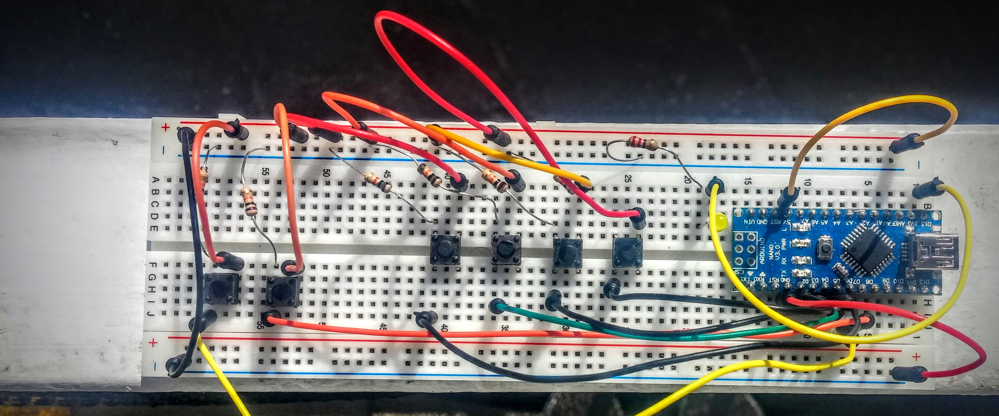
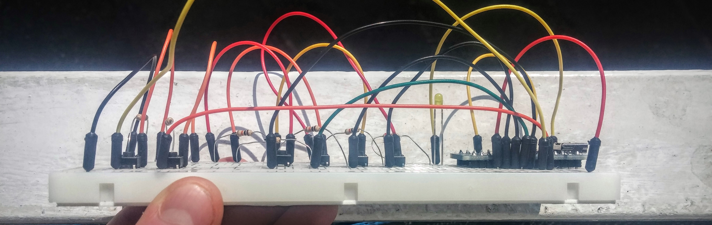

# ArduMouse

**AUTHOR:** Andrea Galloni ([Twitter](https://twitter.com/andreagalloni92))

**E-Mail:** andrea [dot] galloni [at] studenti [dot] unitn [dot] it

---

This simple program emulates a mouse using Arduino Nano and Python.

The environment is composed by two applications.
+  ardumouse.ino running into Arduino
+  ardumouse.py running into the PC.

DEPENDENCES:
  + Python:
    + python-serial
    + python-uinput

  + Arduino:
    + arduino
    + arduino-core
---

## SETUP:

### Ubuntu install:

` user@host:~$ sudo apt-get install arduino arduino-core python-serial python-pip `

` user@host:~$ sudo pip install python-uinput `

### Run:

Upload the schech into Arduino.

Have a look to the tty name then (if needed) edit this line in `ardumouse.py`:

`ser = serial.Serial('edit here with the correct path', 9600)`

then run:

` sudo python ardumouse.py `

    
    
    
    

